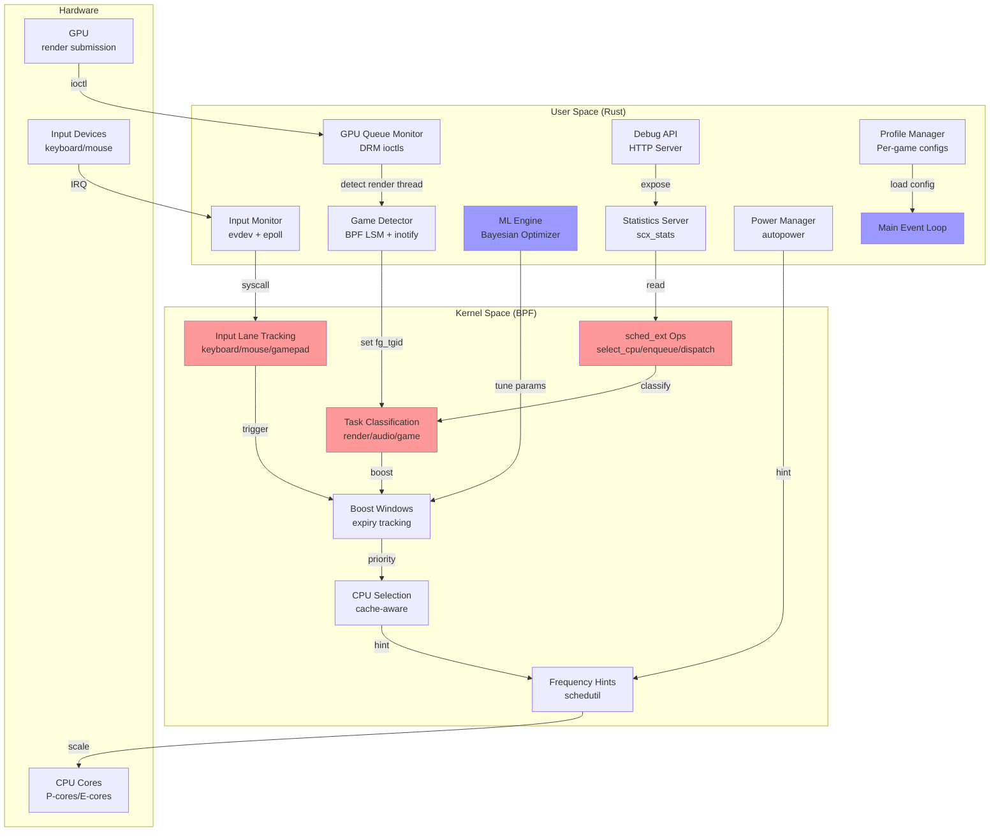
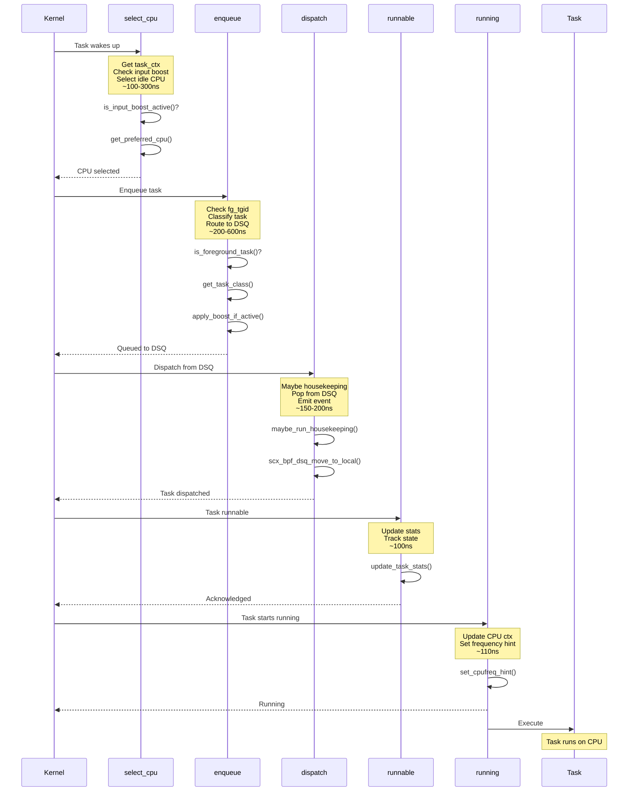
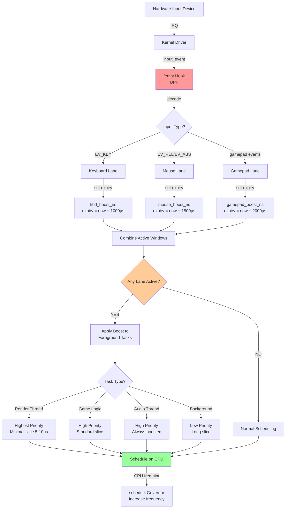
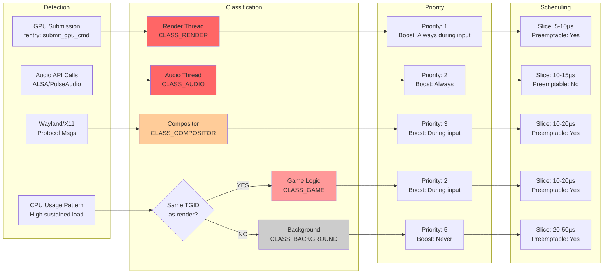
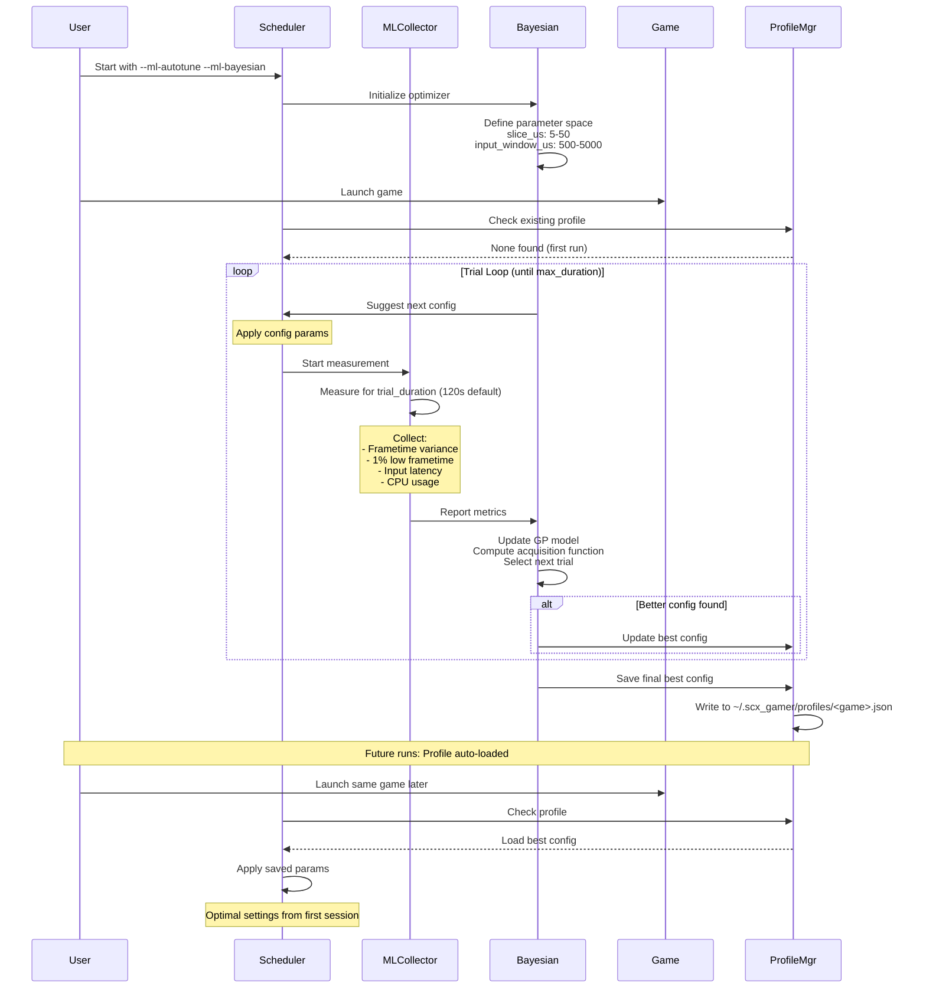
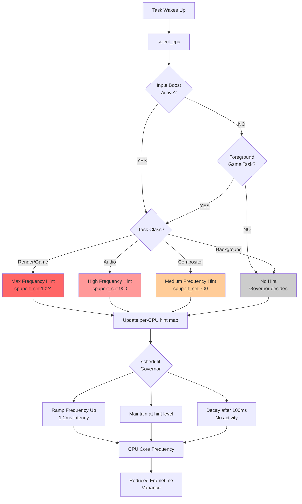
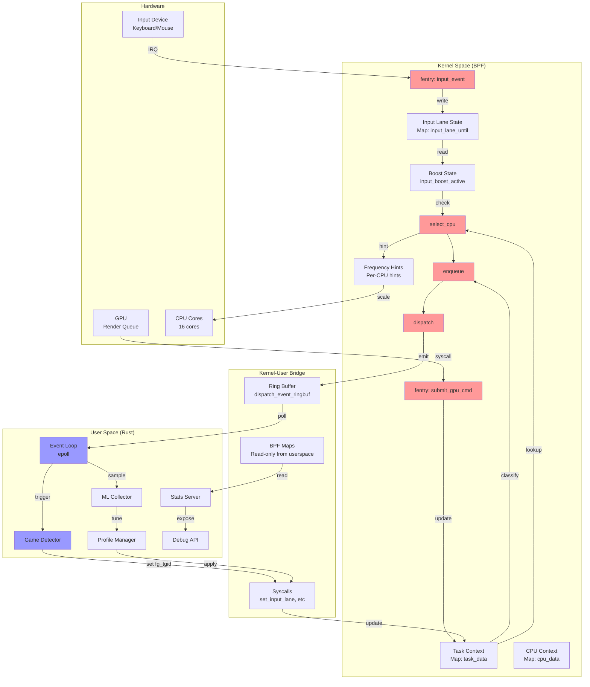
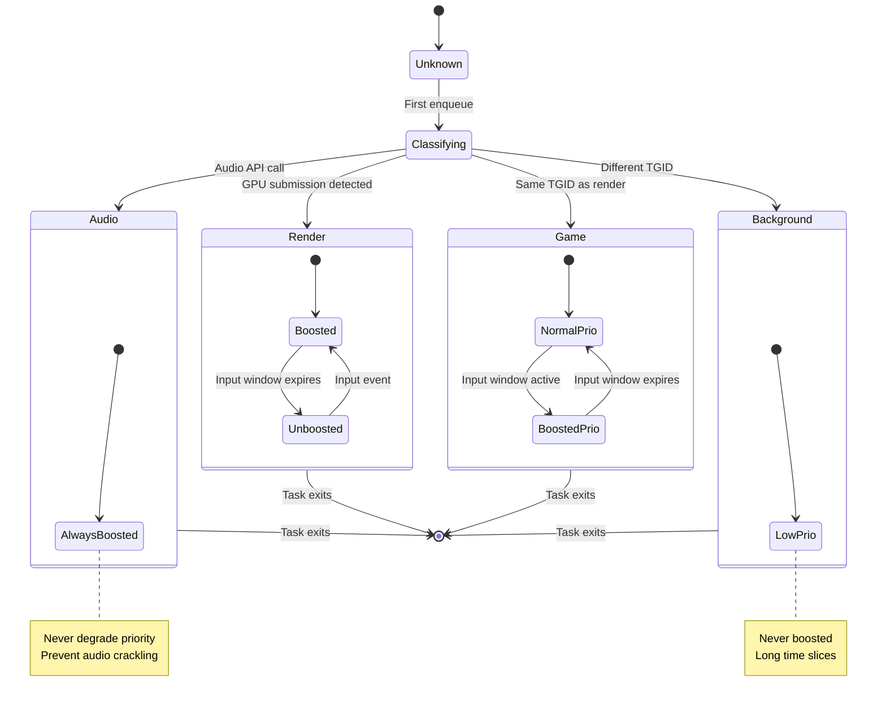
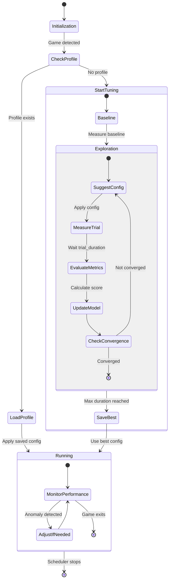

# scx_gamer Architecture - Mermaid Diagrams

**Version:** 1.0.2  
**Purpose:** Visual documentation of the scx_gamer scheduler architecture  
**Audience:** Developers, AI assistants, system architects

This document provides comprehensive Mermaid diagrams documenting the entire scx_gamer scheduler architecture. Each diagram is accompanied by human-readable explanations to facilitate understanding by both humans and AI systems.

---

## Table of Contents

1. [High-Level Architecture](#1-high-level-architecture)
2. [BPF Hot Path Flow](#2-bpf-hot-path-flow)
3. [Input Detection and Boost Flow](#3-input-detection-and-boost-flow)
4. [Game Detection System](#4-game-detection-system)
5. [Task Classification Pipeline](#5-task-classification-pipeline)
6. [ML Autotuning Workflow](#6-ml-autotuning-workflow)
7. [CPU Frequency Control](#7-cpu-frequency-control)
8. [Data Flow Between Components](#8-data-flow-between-components)
9. [Module Dependencies](#9-module-dependencies)
10. [State Machine Diagrams](#10-state-machine-diagrams)

---

## 1. High-Level Architecture

### Overview
The scheduler is split between kernel space (BPF) for low-latency scheduling decisions and user space (Rust) for complex logic.



**Key Design Principles:**
- **Hot path in BPF**: All scheduling decisions (<100ns latency requirement) execute in kernel space
- **Complex logic in Rust**: Game detection, ML training, statistics aggregation in user space
- **Syscall bridge**: Minimal crossing of kernel/user boundary to avoid overhead
- **Event-driven**: Both BPF (fentry hooks) and userspace (epoll) use interrupt-driven patterns

---

## 2. BPF Hot Path Flow

### Overview
The scheduling hot path consists of five sched_ext operations that must execute with minimal latency.



**Performance Targets:**
- `select_cpu`: <300ns (cache lookup + idle scan)
- `enqueue`: <600ns (classification + boost calculation)
- `dispatch`: <200ns (housekeeping amortized)
- `runnable`: <100ns (stats update only)
- `running`: <110ns (frequency hint)

**Total Hot Path:** <1.5µs from wake to run

---

## 3. Input Detection and Boost Flow

### Overview
Input events trigger boost windows that prioritize game threads for consistent latency.



**Timing Breakdown:**
1. Hardware IRQ to kernel driver: ~50-100µs
2. `input_event()` call to fentry hook: ~10-20µs
3. BPF lane update (map write): ~5-15µs
4. Next scheduling decision: ~50-200µs (depends on task activity)
5. **Total: ~200µs** from physical input to boost activation

**Lane Configuration:**
- **Keyboard**: 1000µs window (discrete inputs, short burst)
- **Mouse**: 1500µs window (continuous movement, medium persistence)
- **Gamepad**: 2000µs window (combo inputs, longer hold)

---

## 4. Game Detection System

### Overview
Two-tier detection system with BPF LSM for modern kernels and inotify fallback.

```mermaid
stateDiagram-v2
    [*] --> Init
    
    Init --> TryBPF: Attempt BPF LSM
    TryBPF --> BPFActive: Success (kernel 6.17+)
    TryBPF --> Fallback: Failed (older kernel)
    
    state BPFActive {
        [*] --> WaitBPF
        WaitBPF --> FileOpen: bpf_lsm_file_open
        FileOpen --> CheckPath{GPU device?}
        CheckPath --> GpuDetect: /dev/dri/*
        CheckPath --> WaitBPF: other file
        
        WaitBPF --> TaskAlloc: bpf_lsm_task_alloc
        TaskAlloc --> CheckExe{Steam/Lutris path?}
        CheckExe --> GameDetect: Match
        CheckExe --> WaitBPF: No match
        
        GpuDetect --> SetForeground
        GameDetect --> SetForeground
        SetForeground --> Active
        Active --> GameExit: Process exits
        GameExit --> WaitBPF
    }
    
    state Fallback {
        [*] --> WaitInotify
        WaitInotify --> ProcScan: 5Hz polling
        ProcScan --> CheckComm{/proc/[pid]/comm}
        CheckComm --> MatchEngine{Known engine?}
        MatchEngine --> SetFGInotify: Unity/Unreal/etc
        MatchEngine --> WaitInotify: No match
        SetFGInotify --> ActiveInotify
        ActiveInotify --> PollExit: Check every 5s
        PollExit --> WaitInotify: Process gone
    }
    
    state "Foreground Set" as SetForeground {
        UpdateMap: Update detected_fg_tgid
        NotifyUser: Notify userspace
        ActivateLanes: Enable input lanes
        UpdateMap --> NotifyUser
        NotifyUser --> ActivateLanes
    }
    
    BPFActive --> [*]: Scheduler exit
    Fallback --> [*]: Scheduler exit
    
    note right of BPFActive
        Overhead: 0.001-0.01% CPU
        Latency: <1ms detection
        Exit detection: <1ms
    end note
    
    note right of Fallback
        Overhead: 0.1-0.5% CPU
        Latency: 0-100ms detection
        Exit detection: ~5s
    end note
```

**Detection Methods:**

**BPF LSM (Tier 1):**
- Hooks: `bpf_lsm_file_open`, `bpf_lsm_task_alloc`
- Triggers: GPU device access, Steam/Lutris executable paths
- Overhead: Event-driven, no polling
- Latency: <1ms (immediate on syscall)

**inotify (Tier 2):**
- Monitors: `/proc/[pid]/comm`, `/proc/[pid]/exe`
- Triggers: Process name matches known game engine list
- Overhead: 5Hz polling (~0.1-0.5% CPU)
- Latency: 0-100ms (polling interval + scan time)

---

## 5. Task Classification Pipeline

### Overview
Automatic classification of threads based on behavior patterns and syscall signatures.



**Classification Table:**

| Class | Detection Method | Priority | Slice | Boost Condition |
|-------|-----------------|----------|-------|-----------------|
| `CLASS_RENDER` | GPU submission syscalls | 1 (Highest) | 5-10µs | Always during input window |
| `CLASS_GAME` | Same TGID as render, high CPU | 2 | 10-20µs | During input window |
| `CLASS_AUDIO` | ALSA/PulseAudio/PipeWire API | 2 | 10-15µs | Always (prevent audio crackling) |
| `CLASS_COMPOSITOR` | Wayland/X11/DRM protocols | 3 | 10-20µs | During input window |
| `CLASS_BACKGROUND` | Different TGID, low priority | 5 (Lowest) | 20-50µs | Never |

**Classification Latency:**
- Initial detection: <1ms (first GPU submission or audio call)
- Reclassification: <100µs (if behavior changes)
- Persistent: Cached in `task_ctx` per-task structure

---

## 6. ML Autotuning Workflow

### Overview
Bayesian optimization for automated parameter tuning per game.



**Parameter Space:**

| Parameter | Range | Default | Impact |
|-----------|-------|---------|--------|
| `slice_us` | 5-50 | 10 | Preemption granularity |
| `input_window_us` | 500-5000 | 1500 | Boost duration |
| `keyboard_window_us` | 500-2000 | 1000 | Keyboard boost |
| `mouse_window_us` | 500-3000 | 1500 | Mouse boost |
| `primary_domain` | turbo/perf/all | all | CPU core selection |

**Optimization Metrics:**

1. **Primary**: Frametime variance (σ) - minimize
2. **Secondary**: 1% low frametime - maximize
3. **Tertiary**: Input rate / CPU usage ratio - maximize

**Convergence:**
- Typical trials to converge: 5-10
- Time per trial: 120s (configurable)
- Total tuning session: 10-20 minutes
- Saved to: `~/.scx_gamer/profiles/<game_name>.json`

---

## 7. CPU Frequency Control

### Overview
Dynamic frequency scaling hints to schedutil governor for reduced latency.



**Frequency Hint Mapping:**

| Task Class | Boost Active | Hint Value | Target Frequency |
|------------|--------------|------------|------------------|
| Render | Yes | 1024 | Max (Turbo) |
| Game Logic | Yes | 1024 | Max (Turbo) |
| Audio | Always | 900 | 87.5% |
| Compositor | Yes | 700 | 68% |
| Background | N/A | 0 | Governor default |

**Governor Behavior (schedutil):**
- **Ramp-up latency**: 1-2ms from hint to frequency change
- **Decay time**: 100ms after hint removed
- **Power cost**: ~5-10W during gaming, negligible idle
- **Benefit**: Eliminates frequency ramps that cause frame time variance spikes

**Configuration:**
- Enable: `--enable-cpufreq` (default: enabled)
- Disable: `--disable-cpufreq` (use system governor)
- Autopower mode: `--enable-autopower` (dynamic based on load)

---

## 8. Data Flow Between Components

### Overview
Complete data flow from hardware events to scheduling decisions.



**Data Structures:**

**BPF Maps (Kernel → User):**
- `task_data`: Per-task context (classification, stats)
- `cpu_data`: Per-CPU context (utilization, frequency)
- `input_lane_until`: Input lane expiry timestamps
- `detected_fg_tgid`: Foreground game PID

**Ring Buffers (Kernel → User):**
- `dispatch_event_ringbuf`: Dispatch events for watchdog
- `input_event_ringbuf`: Input event metadata (optional)

**Syscalls (User → Kernel):**
- `set_input_lane`: Trigger input boost from userspace
- `set_power_hint`: Power mode suggestions
- `enable_primary_cpu`: Configure CPU domain

---

## 9. Module Dependencies

### Overview
Rust module structure and dependencies.

```mermaid
graph TD
    main[main.rs<br/>Scheduler Entry Point]
    
    main --> bpf_skel[bpf_skel.rs<br/>BPF Skeleton]
    main --> bpf_intf[bpf_intf.rs<br/>BPF Interface]
    
    main --> game_detect[game_detect.rs<br/>inotify Detector]
    main --> game_detect_bpf[game_detect_bpf.rs<br/>BPF LSM Detector]
    
    main --> ml_autotune[ml_autotune.rs<br/>Autotuner]
    ml_autotune --> ml_bayesian[ml_bayesian.rs<br/>Bayesian Optimizer]
    ml_autotune --> ml_collect[ml_collect.rs<br/>Metrics Collector]
    ml_autotune --> ml_scoring[ml_scoring.rs<br/>Score Calculator]
    ml_autotune --> ml_profiles[ml_profiles.rs<br/>Profile Manager]
    
    main --> input_monitor[Input Monitor<br/>evdev devices]
    input_monitor --> ring_buffer[ring_buffer.rs<br/>Ring Buffer Manager]
    input_monitor --> trigger[trigger.rs<br/>Boost Triggers]
    
    main --> gpu_monitor[gpu_queue_monitor.rs<br/>GPU Queue Monitor]
    main --> power_monitor[power_monitor.rs<br/>Power Monitor]
    main --> audio_detect[audio_detect.rs<br/>Audio Server Detect]
    
    main --> stats_mod[stats.rs<br/>Statistics Module]
    stats_mod --> debug_api[debug_api.rs<br/>Debug HTTP API]
    
    main --> tui_mod[tui.rs<br/>Terminal UI]
    main --> cpu_detect[cpu_detect.rs<br/>CPU Topology]
    
    main --> affinity[affinity_override.rs<br/>Affinity Override]
    main --> engine_presets[engine_presets.rs<br/>Engine Presets]
    
    bpf_skel --> bpf_code[BPF Code<br/>main.bpf.c]
    bpf_code --> types[types.bpf.h<br/>Data Structures]
    bpf_code --> helpers[helpers.bpf.h<br/>Helper Functions]
    bpf_code --> boost[boost.bpf.h<br/>Boost Logic]
    bpf_code --> task_class[task_class.bpf.h<br/>Classification]
    bpf_code --> cpu_select[cpu_select.bpf.h<br/>CPU Selection]
    bpf_code --> gpu_detect[gpu_detect.bpf.h<br/>GPU Detection]
    
    style main fill:#9999ff
    style bpf_code fill:#ff9999
    style ml_autotune fill:#99ff99
    style game_detect_bpf fill:#ffcc99
```



**Key Modules:**

**Core:**
- `main.rs`: Scheduler entry point, event loop, orchestration
- `bpf_skel.rs`: Generated BPF skeleton (from libbpf-rs)
- `bpf_intf.rs`: Safe Rust interface to BPF maps/programs

**Detection:**
- `game_detect.rs`: inotify-based game detection (fallback)
- `game_detect_bpf.rs`: BPF LSM-based detection (preferred)
- `audio_detect.rs`: Audio server detection (PulseAudio/PipeWire)

**ML System:**
- `ml_autotune.rs`: Automated parameter tuning coordinator
- `ml_bayesian.rs`: Bayesian optimization implementation
- `ml_collect.rs`: Metrics collection and aggregation
- `ml_profiles.rs`: Per-game profile storage and loading

**Monitoring:**
- `stats.rs`: Statistics aggregation and reporting
- `debug_api.rs`: HTTP API for external monitoring
- `tui.rs`: Terminal UI dashboard

**BPF Components:**
- `main.bpf.c`: Core scheduling logic (select_cpu, enqueue, dispatch)
- `types.bpf.h`: Shared data structures (task_ctx, cpu_ctx)
- `boost.bpf.h`: Input boost window management
- `task_class.bpf.h`: Task classification logic
- `cpu_select.bpf.h`: Cache-aware CPU selection

---

## 10. State Machine Diagrams

### Overview
State transitions for key scheduler components.

#### 10.1 Task State Machine



#### 10.2 Input Lane State Machine

```mermaid
stateDiagram-v2
    [*] --> Idle
    
    Idle --> KeyboardActive: Keyboard input
    Idle --> MouseActive: Mouse input
    Idle --> GamepadActive: Gamepad input
    
    state KeyboardActive {
        [*] --> Expiry1000
        Expiry1000 --> CheckRefresh: Time passes
        CheckRefresh --> Expiry1000: Key still held
        CheckRefresh --> Expired: Window expires
    }
    
    state MouseActive {
        [*] --> Expiry1500
        Expiry1500 --> CheckMove: Time passes
        CheckMove --> Expiry1500: Movement detected
        CheckMove --> Expired: Window expires
    }
    
    state GamepadActive {
        [*] --> Expiry2000
        Expiry2000 --> CheckButton: Time passes
        CheckButton --> Expiry2000: Button still pressed
        CheckButton --> Expired: Window expires
    }
    
    KeyboardActive --> Idle: All windows expired
    MouseActive --> Idle: All windows expired
    GamepadActive --> Idle: All windows expired
    
    state Expired {
        note right of Expired: Lane inactive<br/>Boost removed<br/>Tasks return to<br/>normal priority
    }
```

#### 10.3 ML Autotuning State Machine



---

## Summary

This document provides a comprehensive visual reference for the scx_gamer scheduler architecture. The diagrams cover:

1. **System Architecture**: Separation of concerns between kernel (BPF) and user space (Rust)
2. **Hot Path Flow**: Critical scheduling operations with performance targets
3. **Input Detection**: Low-latency input event processing and boost triggering
4. **Game Detection**: Dual-tier detection system with automatic fallback
5. **Task Classification**: Automatic thread categorization based on behavior
6. **ML Autotuning**: Bayesian optimization for per-game parameter tuning
7. **CPU Frequency**: Dynamic frequency scaling for reduced latency
8. **Data Flow**: Complete flow from hardware to scheduling decisions
9. **Module Dependencies**: Rust module structure and relationships
10. **State Machines**: State transitions for key components

**For AI Systems:**
- These diagrams represent the complete design and can be used to understand system behavior
- All timing values (<100ns, ~200µs, etc.) are measured performance targets
- Map names and function names correspond to actual code symbols
- State transitions reflect runtime behavior under typical gaming workloads

**For Human Developers:**
- Use these diagrams as reference when modifying the scheduler
- Performance targets should be validated after changes
- State machines define expected behavior for testing
- Data flow diagrams help identify optimization opportunities

**Version:** This document reflects scx_gamer 1.0.2 architecture as of 2025-11-19.

